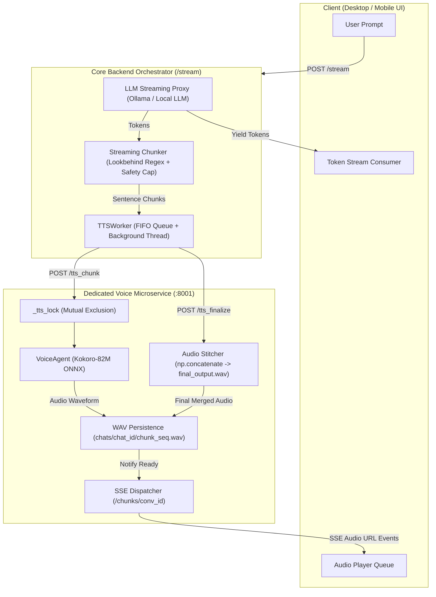
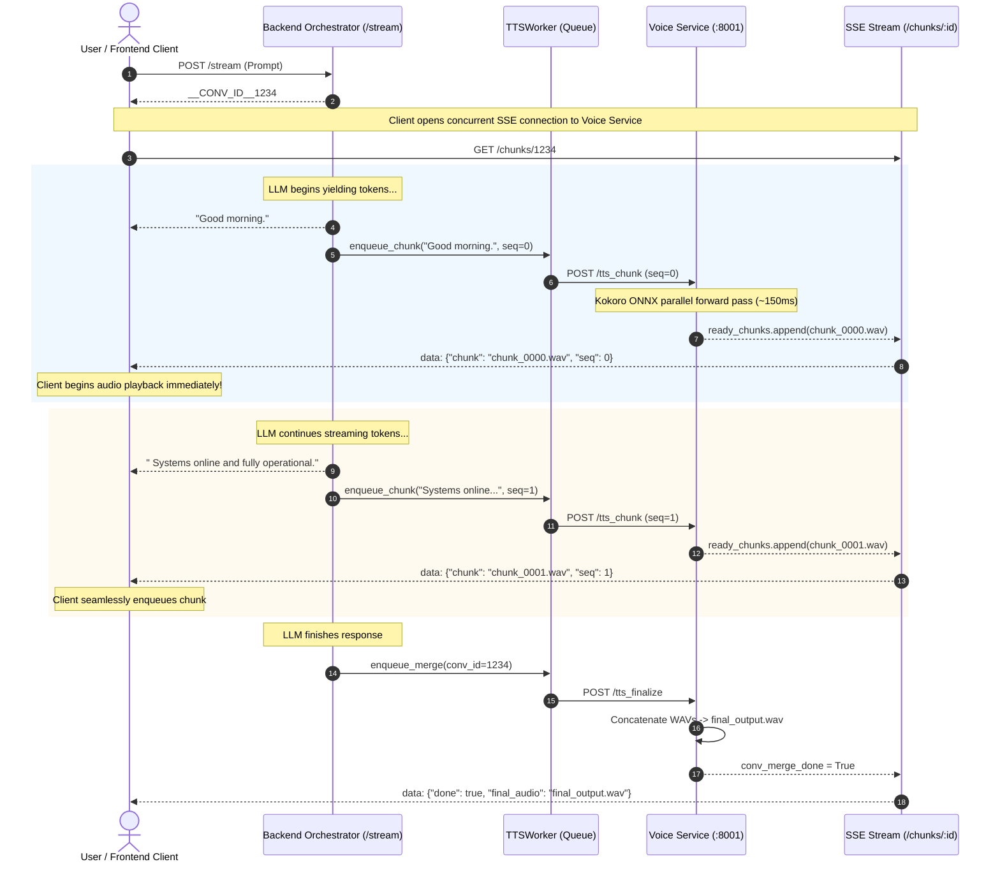

# Elyestra Streaming Voice Pipeline — Architecture Overview

## 1. Executive Summary

The **Elyestra Streaming Voice Pipeline** is a low-latency, dual-channel conversational voice architecture engineered to deliver synthesized speech while large language model (LLM) tokens are still being generated.

Running on resource-constrained hardware (standard CPU environments without high-end dedicated GPUs), traditional voice pipelines suffer from severe latency bottlenecks caused by:
1. Waiting for the complete LLM response before initiating synthesis.
2. Autoregressive neural TTS inference where speech acoustic tokens are generated step-by-step in an iterative loop.
3. Dynamic speaker embedding extraction and tensor caching per chunk at runtime.

Elyestra solves this through an integrated four-stage pipeline:
- **Lookbehind Sentence Boundary Chunking**: Intercepts punctuation boundaries on incoming tokens with word-count overflow safeguards.
- **Decoupled FIFO Worker Queue**: Shields the token generator from network and I/O latency.
- **Non-Autoregressive ONNX Inference (Kokoro-82M)**: Synthesizes entire sentence waveforms in a single parallel forward pass (< 200ms on CPU).
- **Pre-computed Style Vectors**: Replaces runtime embedding extraction with pre-quantized 1D style tensors from `voices-v1.0.bin`.
- **Dual-Channel Server-Sent Events (SSE)**: Streams text tokens to the UI while simultaneously broadcasting audio chunk URLs to the client's playback queue.

---

## 2. End-to-End System Diagram

---

## 3. Dual-Channel Streaming Sequence

---

## 4. Detailed Component Breakdown

### 4.1. Streaming Text Chunker (`streaming_chunker.py`)
- **Lookbehind Boundary Split**: `re.split(r'(?<=[.!?]) +', buffer)` isolates full sentences while keeping terminal punctuation attached to the spoken phrase.
- **Word Piece Normalization**: `tts_word_pieces` caps any phrase to `max_tts_words` (default 15 words). This prevents long compound sentences from forming monolithic chunks that introduce latency spikes.
- **Buffer Overflow Safeguard**: In the event of punctuation-free streaming (e.g., code snippets, formatted data, or run-on thoughts), an overflow check triggers when buffer size exceeds `max_buffer_words` (default 30 words), forcing a slice of `max_tts_words` into the queue.
- **Tail Flush**: When the token stream finishes, any remaining buffered text is flushed as the final chunk.

### 4.2. Asynchronous TTS Worker (`tts_worker.py`)
- **Queue Decoupling**: A Python `queue.Queue` fed by the token loop and consumed by a background daemon thread (`TTSWorkerThread`).
- **Isolation**: Network hiccups, disk I/O, or audio synthesis pauses never block the fast token streaming response delivered to the user.
- **Sequential Guarantee**: Ensures chunks are dispatched with strictly monotonically increasing sequence IDs (`seq=0, 1, 2...`).

### 4.3. Voice Service Microservice (`voice_service.py`)
- **Global Lock (`_tts_lock`)**: On constrained CPU/GPU hardware, running parallel neural network inferences causes resource contention, context switching thrashing, and high latency. `_tts_lock` ensures one chunk synthesizes to completion before the next begins.
- **State Tracking (`ready_chunks`)**: An in-memory ledger maps conversation IDs to generated chunk file paths.
- **Server-Sent Events (`GET /chunks/{conv_id}`)**: An async SSE generator polls `ready_chunks` every ~50-80ms and emits chunk URLs as soon as they are written to disk.

### 4.4. Non-Autoregressive Voice Agent (`voice_agent.py`)
- **Kokoro-82M ONNX Runtime**: Uses an 82-million parameter StyleTTS 2 + ISTFTNet architecture exported to ONNX.
- **Pre-computed Style Vectors**: Instead of computing speaker embeddings dynamically per request, speaker characteristics (`af_bella`) are pre-extracted and stored in `voices-v1.0.bin`.
- **Elimination of Embedding Cache**: Replaces runtime PyTorch tensor extraction (`clear_embedding_cache()` is kept purely for backward API compatibility).
- **Single Forward Pass**: The complete waveform is generated in one step rather than looping token-by-token. Real-Time Factor on CPU is consistently `< 0.15` (synthesis is 6x–10x faster than real-time playback).

### 4.5. Audio Concatenator (`merge_audio_chunks`)
- Once all chunks are synthesized, `VoiceAgent.merge_audio_chunks()` queries the ordered list of `.wav` files, reads their raw audio arrays, concatenates them via `numpy.concatenate`, and writes a single clean `final_output.wav`.
- The merged file is stored for full message replay, voice message history, and database persistence.

---

## 5. Visual Pipeline Diagrams

Refer to the included pipeline diagrams extracted directly from the system design:

1. **End-to-End Voice Pipeline**: `docs/voice_pipeline_v1.png`
2. **Stream Orchestration Pipeline**: `docs/StreamPipeline_v1.png`

